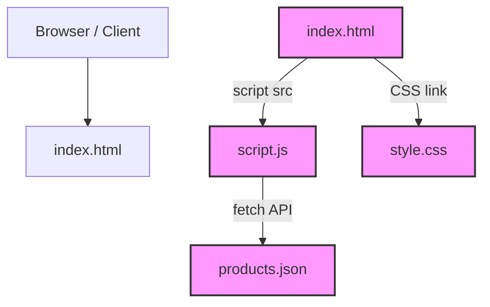

# NitStore | Minimalist Productivity Store

**NitStore** is a high-performance, Single Page Application (SPA) built to demonstrate advanced web systems integration concepts. Featuring a premium dark-mode aesthetic, it serves as an e-commerce platform for minimalist productivity tools while integrating core API and security concepts.

> **Live Demo**: [Insert Vercel/Netlify Link Here]

---

## 🚀 Key Features

* **REST API Integration**: Dynamically fetches product data using the native `Fetch API` and `Async/Await`.
* **Single Page Application (SPA)**: Custom Vanilla JS routing allows for seamless, zero-refresh navigation between the storefront and developer environments.
* **HTTP Status Handling**: Gracefully catches and displays simulated API responses (200 OK, 404, 500).
* **Developer Dashboard**: A secure, hidden routing interface built for administrators to access system architecture documentation.
* **Authentication Simulation**: Validates credentials and generates a Base64 encoded JSON Web Token (JWT) upon successful login.
* **Premium UI/UX**: Built entirely with Vanilla CSS, featuring glassmorphism, dynamic mouse-tracking hover effects, and CSS variables for a cohesive dark-mode aesthetic.

## 🛠️ Technical Architecture

This project was built to satisfy specific system integration requirements:
1. **REST over SOAP**: Implements lightweight JSON data transfer rather than legacy XML/WSDL protocols.
2. **Edge Deployment**: Designed for CI/CD pipelines via GitHub to edge networks like Vercel.
3. **Zero Dependencies**: 100% Vanilla HTML, CSS, and JavaScript. No external frameworks or libraries were used.

---

## 🔒 Developer Access (Testing)

To test the authentication flow and view the integrated architecture documentation:

1. Click on the **Login** tab in the navigation bar.
2. Enter the following credentials:
   * **Username**: `admin`
   * **Password**: `nit-secure`
3. Upon verification, the UI will transition to the Developer Dashboard, revealing the generated JWT and backend documentation.

---

## 💻 Local Installation

Because this application utilizes the Fetch API to retrieve local JSON data, running on a local web server (like **Live Server**) is recommended. However, a **seamless offline fallback** is natively embedded to render the complete catalog even if opened directly via the `file://` protocol.

1. Clone the repository:
   ```bash
   git clone https://github.com/yourusername/NitStore.git
   ```
2. Simply open `index.html` in any modern browser, or launch via Live Server for native Fetch API simulation.

---
*Built for Advanced Web Systems Integration.*


<!-- AUTO-GENERATED-DOCS:START -->
## 🤖 Autonomous Repository Analysis

*Last Updated: 2026-07-04T03:41:29.798Z*

### 🧠 AI Architecture Summary
*(AI summary generation skipped - No API key provided. Add OPENAI_API_KEY to your repository secrets to enable AI documentation.)*

### 📊 Repository Structure
```text
├── README.md
├── docs
│   ├── architecture.md
│   └── data_flow.md
├── index.html
├── products.json
├── script.js
├── scripts
│   ├── analysis.json
│   ├── analyze.js
│   ├── generate_diagrams.js
│   └── update_docs.js
└── style.css

```

### 🛠️ Detected Technologies
- HTML5
- CSS3
- Vanilla JavaScript
- JSON Data Storage

### 🏗️ Dynamic Architecture Diagram

# Dynamic System Architecture




<!-- AUTO-GENERATED-DOCS:END -->
