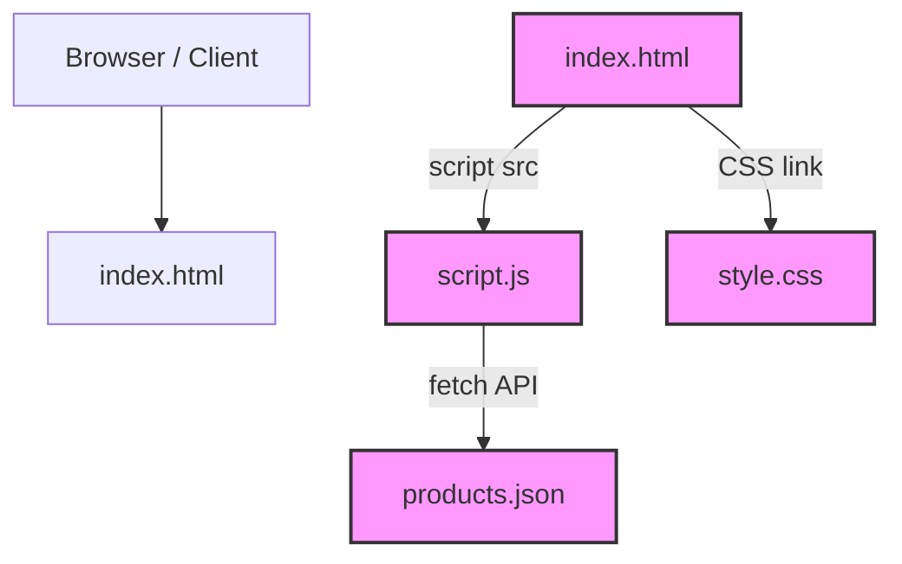

# Dynamic System Architecture

```mermaid
graph TD
    Client[Browser / Client]

    Client --> index.html
    index_html[index.html]
    products_json[products.json]
    script_js[script.js]
    style_css[style.css]

    index_html -->|script src| script_js
    index_html -->|CSS link| style_css
    script_js -->|fetch API| products_json

    classDef file fill:#f9f,stroke:#333,stroke-width:2px;
    class index_html,products_json,script_js,style_css file;
```
