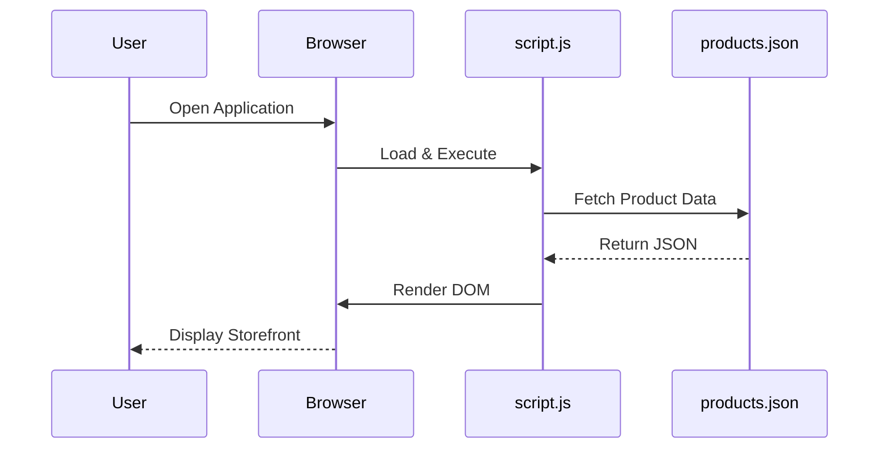

# Data Flow

```mermaid
sequenceDiagram
    participant User
    participant Browser
    participant JS as script.js
    participant Data as products.json

    User->>Browser: Open Application
    Browser->>JS: Load & Execute
    JS->>Data: Fetch Product Data
    Data-->>JS: Return JSON
    JS->>Browser: Render DOM
    Browser-->>User: Display Storefront
```
